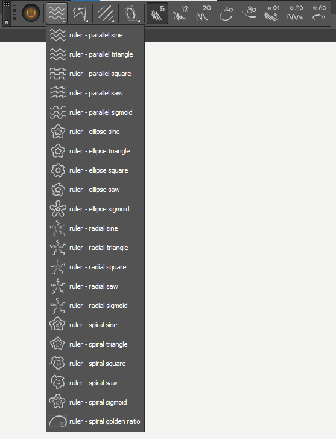
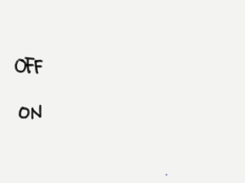
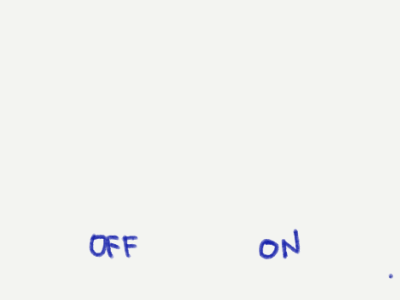
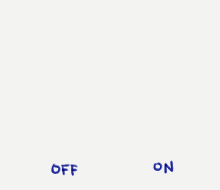
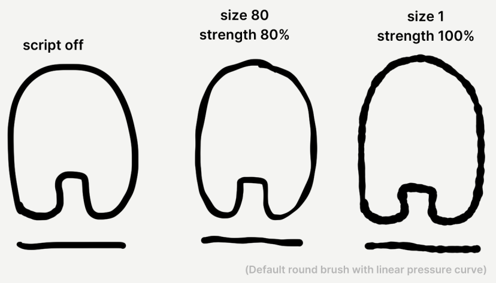
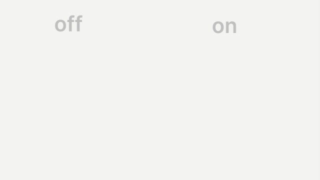

# pharan-lazynezumi
Some customization and scripts I made for Lazy Nezumi Pro (LNP)

# Icon Set
## How to install an icon set to LNP
As of **Lazy Nezumi Pro Version 22.10.05.2045**:

Each icon set is a folder containing png files for each icon.

Copy the folder containing the icon pngs into the folder named `icons` inside the LNP install folder.

By default, this is `C:\Program Files (x86)\Lazy Nezumi Pro\icons\` .

In the main window of Lazy Nezumi Pro, choose `Settings > Toolbar Settings > Edit toolbar.xml`. This will open the settings file in your text editor. 

Change the value inside the `<iconfolder>` tag to the folder you want.

For example: `<iconfolder>icons/yournewiconpackfolder</iconfolder>` .

Save the file. You may need to close and open LNP again for it to fully take effect.

## Pharan's LNP Icon Set
  
It looks like this.  

# Scripts
## How to install scripts in LNP
As of **Lazy Nezumi Pro Version 22.10.05.2045**:

Each script is an `.xml` file.
The name of the script you select in the LNP interface comes from the filename.

Copy the scripts (.xml files) and paste it into the folder named `distortion` inside the LNP install folder.

By default, this is `C:\Program Files (x86)\Lazy Nezumi Pro\distortion\` .

There are already subfolders inside the `distortion` folder for each category. Make your own subfolder. The name will be used as the heading in the script list.

## Pharan's LNP Scripts
### dotted line
  
Use **dotted line** to make dotted lines.  
> This requires your brush to respond to pen pressure. If the brush still draws at near-zero pressure, lines will be drawn in the gaps accordingly.  
> LNP or your drawing program may apply some pressure smoothing so drawing too quickly may yield incorrect results.

### unstraighten - slight wobble
  
Use **unstraighten** to add a slight wobble to lines and shapes.

### unstraighten - rocky surface
  
Also try **rocky surface** for a more jagged look.

### pressure - pressure multiplier
  
If your pen pressure settings don't agree with the calibration of a certain brush for what you need it to do, use **pressure multiplier** to temporarily harden or soften your pressure.  

### pressure - wobble
 
  
Use this script to achieve a loose-ink/melty-crayon/Flash brush look. The "size" parameter gives you more flexibility vs the noise provided by most painting software.

---

If you're a digital artist on Windows and you don't have Lazy Nezumi Pro yet, go check it out!
Use my affiliate link so they know I sent you: https://lazynezumi.com/?ai=pharan
(I don't get a kickback but if the numbers are nice, maybe I get to pester them about it. 🥳)